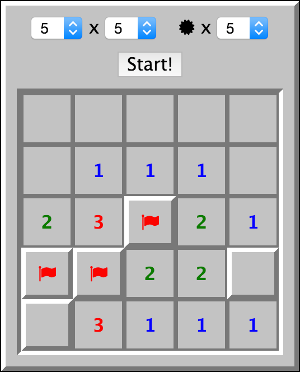

# minesweeper



This app is a minesweeper clone I wrote in early 2015.

## Requirements
* ruby(2.1.4 or later)
* bundler(gem)

## How to play
### Online
Let's access [GitHub Pages](http://yasaichi.github.io/minesweeper/)!

### Offline
```sh
git clone git@github.com:yasaichi/minesweeper.git
cd minesweeper
bundle install
bundle exec middleman server
```

